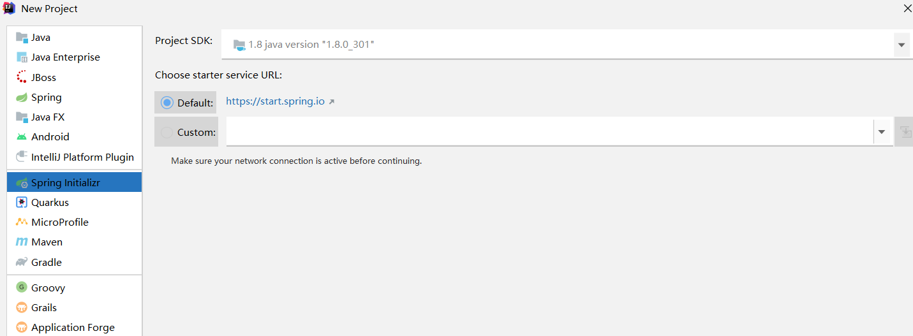
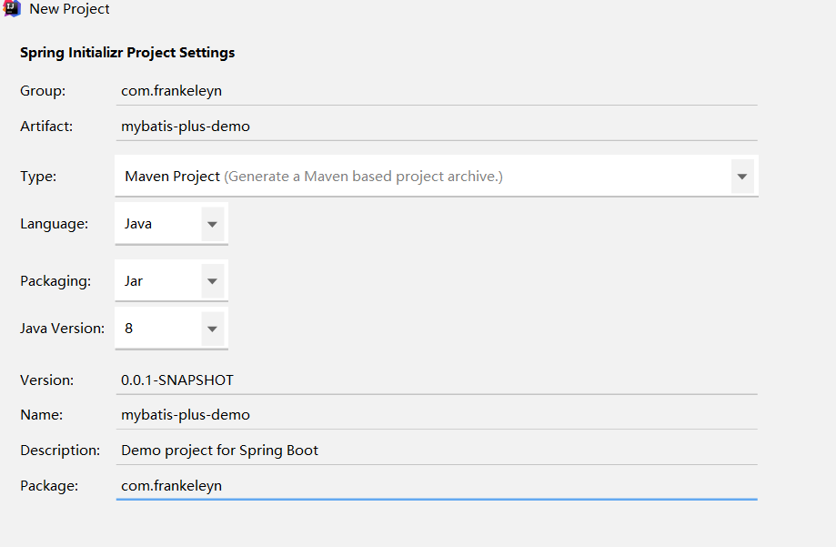
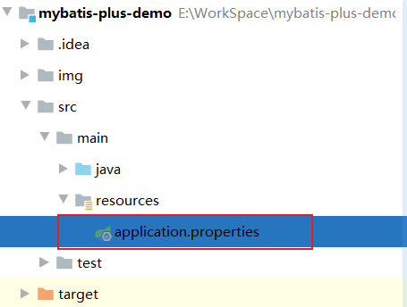
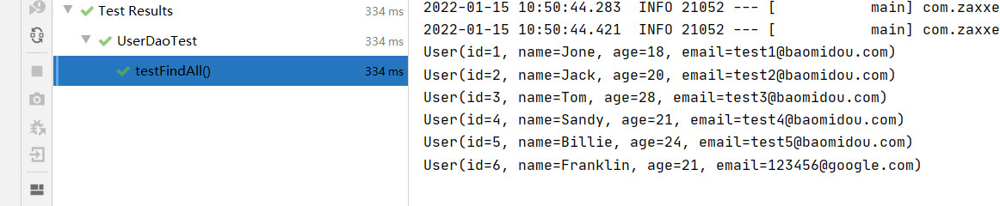
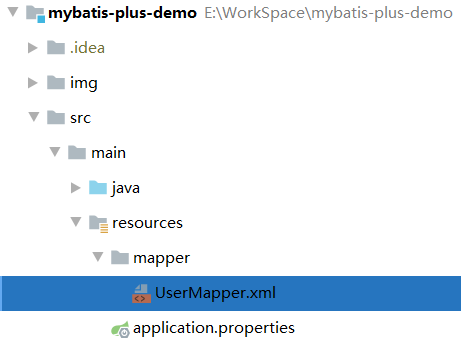
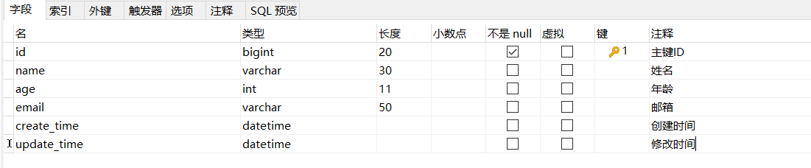

# MybatisPlus Demo


## 简介

[MyBatis-Plus ](https://baomidou.com/)（简称 MP）是一个 MyBatis 的增强工具，在 MyBatis 的基础上只做增强不做改变，为简化开发、提高效率而生。


## 入门案例


### 1. 创建数据表 User

```mysql
CREATE TABLE user
(
	id BIGINT(20) NOT NULL COMMENT '主键ID',
	name VARCHAR(30) NULL DEFAULT NULL COMMENT '姓名',
	age INT(11) NULL DEFAULT NULL COMMENT '年龄',
	email VARCHAR(50) NULL DEFAULT NULL COMMENT '邮箱',
	PRIMARY KEY (id)
);
INSERT INTO user (id, name, age, email) VALUES
(1, 'Jone', 18, 'test1@baomidou.com'),
(2, 'Jack', 20, 'test2@baomidou.com'),
(3, 'Tom', 28, 'test3@baomidou.com'),
(4, 'Sandy', 21, 'test4@baomidou.com'),
(5, 'Billie', 24, 'test5@baomidou.com');
```


### 2. 创建 Spring Boot 工程







### 3. 引入依赖

修改你的 pom 文件

```xml
    <!-- 配置 Spring Boot 版本 -->
    <parent>
        <groupId>org.springframework.boot</groupId>
        <artifactId>spring-boot-starter-parent</artifactId>
        <version>2.3.4.RELEASE</version>
    </parent>

    <dependencies>
        
        <dependency>
            <groupId>org.springframework.boot</groupId>
            <artifactId>spring-boot-starter-web</artifactId>
        </dependency>

        <dependency>
            <groupId>org.springframework.boot</groupId>
            <artifactId>spring-boot-devtools</artifactId>
            <scope>runtime</scope>
            <optional>true</optional>
        </dependency>

        <dependency>
            <groupId>org.springframework.boot</groupId>
            <artifactId>spring-boot-starter</artifactId>
        </dependency>

        <dependency>
            <groupId>com.baomidou</groupId>
            <artifactId>mybatis-plus-boot-starter</artifactId>
            <version>3.4.1</version>
        </dependency>

        <dependency>
            <groupId>mysql</groupId>
            <artifactId>mysql-connector-java</artifactId>
            <scope>runtime</scope>
        </dependency>

        <dependency>
            <groupId>org.projectlombok</groupId>
            <artifactId>lombok</artifactId>
            <optional>true</optional>
        </dependency>

        <dependency>
            <groupId>org.springframework.boot</groupId>
            <artifactId>spring-boot-starter-test</artifactId>
            <scope>test</scope>
        </dependency>
        
    </dependencies>
```


### 4. 修改配置文件



```properties
# 端口号
server.port= 8082

# ==================== 数据源设置 =========================
spring.datasource.driver-class-name=com.mysql.cj.jdbc.Driver
spring.datasource.url=jdbc:mysql://localhost:3306/test?serverTimezone=GMT%2B8&characterEncoding=utf-8&useSSL=false
spring.datasource.username=root
spring.datasource.password=123456

# ================ mybatis 配置 =========================
# 驼峰命名
mybatis-plus.configuration.map-underscore-to-camel-case=true
# 扫描映射配置文件
mybatis-plus.mapper-locations=classpath:mapper/*Mapper.xml
```


### 5. 创建实体类

创建包 **entity** 并创建 **User** 实体类

```java
package com.frankeleyn.entity;

import lombok.AllArgsConstructor;
import lombok.Builder;
import lombok.Data;
import lombok.NoArgsConstructor;

/**
 * @author Frankeleyn
 * @date 2022/1/14 16:24
 */
@Data
@NoArgsConstructor
@AllArgsConstructor
@Builder
public class User {

    // 主键
    private Long id;

    // 名字
    private String name;

    // 年龄
    private Integer age;

    // 邮箱
    private String email;

}
```


### 6. 创建 Mapper 接口

创建包 **mapper** 并创建 **UserMapper** 接口继承 **BaseMapper** 接口

```java
package com.frankeleyn.mapper;

import com.baomidou.mybatisplus.core.mapper.BaseMapper;
import com.frankeleyn.entity.User;

/**
 * @author Frankeleyn
 * @date 2022/1/14 16:33
 */
public interface UserMapper extends BaseMapper<User> {
    
}
```


### 7. 添加启动类注解

给启动类添加注解 **@MapperScan** ，要不然会报一个找不到 Mapper 的错误

```java
package com.frankeleyn;

import org.mybatis.spring.annotation.MapperScan;
import org.springframework.boot.SpringApplication;
import org.springframework.boot.autoconfigure.SpringBootApplication;

@SpringBootApplication
@MapperScan("com.frankeleyn.mapper")
public class MybatisPlusDemoApplication {

    public static void main(String[] args) {
        SpringApplication.run(MybatisPlusDemoApplication.class, args);
    }

}
```


### 8. 添加测试类进行功能测试

```java
package com.frankeleyn;

import com.frankeleyn.mapper.UserMapper;
import org.junit.jupiter.api.Test;
import org.springframework.beans.factory.annotation.Autowired;
import org.springframework.boot.test.context.SpringBootTest;

/**
 * @author Frankeleyn
 * @date 2022/1/15 10:42
 */
@SpringBootTest
public class UserDaoTest {
    @Autowired
    private UserMapper userMapper;

    @Test
    public void testFindAll() {
        userMapper.selectList(null).forEach(System.out::println);
    }
}
```

打印结果：




## 基本用法


### 一、通用 Mapper

在 **Mybatis Plus** 框架中不需要实现 xml 映射配置文件和对应的 sql，它默认有单表的增删改查，都已经在 **BaseMapper\<T>** 中实现了，我们只需要声明一个 Mapper 接口，并继承它就能使用，就像上文入门案例的 [**UserMapper**](##6. 创建 Mapper 接口) 一样。


#### 1. Insert

```java
@Test
public void testInsert() {
    // 构造器模式创建 User 对象
    User user = User.builder()
        .name("Vincent")
        .age(33)
        .email("Vincent@qq.com").build();

    int row = userMapper.insert(user);
    System.out.println("影响的行数：" + row);
    System.out.println("获取自动生成的 id: " + user.getId());
}
```


#### 2. Selete

```java
@Test
public void testSelect() {
    // 根据 id 查询用户
    User user1 = userMapper.selectById(1L);
    System.out.println(user1);

    // 根据 id 列表查询多个用户
    List<User> userList = userMapper.selectBatchIds(Arrays.asList(2L, 3L, 4L));
    userList.forEach(System.out::println);

    // 根据 map 中的条件查询
    Map map = new HashMap();
    // map 的键使用数据库的字段名，不是类中的属性名
    map.put("name", "Franklin");
    map.put("age", "21");
    List usersList = userMapper.selectByMap(map);
    usersList.forEach(System.out::println);
}
```


#### 3. Update

```java
@Test
public void testUpdate() {
    User user = userMapper.selectById(1L);
    user.setAge(28);

    // 更新 id 为 1的用户年龄为 28
    int row = userMapper.updateById(user);
    System.out.println("影响的行数： " + row);
}
```


#### 4. Delete

```java
@Test
public void testDelete() {
    // 删除 id 为5的用户
    int row = userMapper.deleteById(5);
    System.out.println("影响的行数： " + row);
}
```


### 二、通用 Service

**mybatis-plus** 提供一个接口 **IService** 和其实现类 **ServiceImpl** ，封装了常见单表的业务层逻辑，也是 CRUD。


#### 1. 创建 Service 接口

```java
package com.frankeleyn.service;

import com.baomidou.mybatisplus.extension.service.IService;
import com.frankeleyn.entity.User;

/**
 * @author Frankeleyn
 * @date 2022/1/17 10:15
 */
public interface UserService extends IService<User> {
    
}
```


#### 2. 创建 Service 实现类

```java
package com.frankeleyn.service.impl;

import com.baomidou.mybatisplus.extension.service.impl.ServiceImpl;
import com.frankeleyn.entity.User;
import com.frankeleyn.mapper.UserMapper;
import com.frankeleyn.service.UserService;

/**
 * @author Frankeleyn
 * @date 2022/1/17 10:16
 */
@Service
public class UserServiceImpl extends ServiceImpl<UserMapper, User> implements UserService {
    
}
```


####  3. 创建测试类

```java
package com.frankeleyn;

import com.frankeleyn.service.UserService;
import org.springframework.beans.factory.annotation.Autowired;
import org.springframework.boot.test.context.SpringBootTest;

/**
 * @author Frankeleyn
 * @date 2022/1/17 10:19
 */
@SpringBootTest
public class UserServiceTest {

    @Autowired
    private UserService userService;
    
}
```


#### 4. 获取总记录数

```java
@Test
public void testAdd() {
    // 获取数据库所有记录数
    int count = userService.count();
    System.out.println(count);
}
```


#### 5. 批量插入数据

```java
@Test
public void testBatchAdd() {
    // 测试批量插入数据
    ArrayList<User> users = new ArrayList<>();
    for (int i = 0; i < 5; i++) {
        User user = new User();
        user.setName("Obama" + i);
        user.setAge(10 + i);
        users.add(user);
    }
    userService.saveBatch(users);
}
```


### 三、自定义 Mapper

如果通用 Mapper 不符号我们的需求，我们也可以像以前使用 Mybatis 一样，自定义接口方法并配置 xml 文件，写 sql 语句。


#### 1. 接口方法

在 UserMapper 中定义一个方法 **findUsersByName**

```java
public interface UserMapper extends BaseMapper<User> {
    List<User> findUsersByName(String name);
}
```


#### 2. 创建配置文件

在 resource 目录下新建 **mapper** 文件夹，创建 **UserMapper.xml**



```xml
<?xml version="1.0" encoding="UTF-8"?>
<!DOCTYPE mapper PUBLIC "-//mybatis.org//DTD Mapper 3.0//EN" "http://mybatis.org/dtd/mybatis-3-mapper.dtd">

<mapper namespace="com.frankeleyn.mapper.UserMapper">
    <select id="findUsersByName" resultType="com.frankeleyn.entity.User">
        SELECT * FROM user
        WHERE name like "%"#{name}"%"
    </select>
</mapper>
```


#### 3. 测试自定义条件查询

```java
@Test
public void testFindUserByName() {
    // 查询用户名字中带有 Obama 
    List<User> userList = userMapper.findUsersByName("Obama");
    userList.forEach(System.out::println);
}
```


## 常用注解


### 一、 TableName

表名，将实体类绑定到对应的数据库

```java
@TableName("t_user")
public class User{
    
}
```


### 二、TableId

#### type 属性

type 属性用来指定主键策略

- **AUTO**，主键自增，Mysql 主键自增的最小值总是要大于现有数据的最大值

  ```java
  @TableId(type = IdType.AUTO)
  private Long id;
  ```

- **ASSIGN_ID**，使用**雪花算法**生成主键，例: 1482xxxxxxxxxxx

  ```java
  @TableId(type = IdType.ASSIGN_ID)
  private Long id;
  ```

**id 策略的选择**

一般小数据量，使用自增策略，当数据量超过千万级别后，涉及分库分表，需要使用雪花算法。


### 三、TableField

#### 1. value 属性

将数据库字段和实体类对应的属性绑定

将字段 create_time 和 update_time 绑定到实体类的 createTime 和 updateTime 属性上



```java
@TableField("create_time")
private LocalDateTime createTime;

@TableField("update_time")
private LocalDateTime updateTime;
```


#### 2. 自动填充

对于字段，比如 create_time 和 update_time 一般情况下不用刻意处理，可以将这两个字段的默认值设为 **CURRENT_TIMESTAMP** 以获取当前时间。

MyBatis Plus 提供了自动填充功能，同样可以完成这些字段的赋值工作。

- 添加 **fill** 属性，指定在哪个操作执行时自动填充

  ```java
  @TableField(value = "create_time", fill = FieldFill.INSERT)
  private LocalDateTime createTime;
  
  @TableField(value = "update_time", fill = FieldFill.INSERT_UPDATE)
  private LocalDateTime updateTime;
  ```

- 配置元数据对象处理器

  ```java
  @Component
  public class MyMetaObjectHandler implements MetaObjectHandler {
      @Override
      public void insertFill(MetaObject metaObject) {
          System.out.println("insertFill...");
          this.strictInsertFill(metaObject, "createTime", LocalDateTime.class, LocalDateTime.now());
          this.strictInsertFill(metaObject, "updateTime", LocalDateTime.class, LocalDateTime.now());
      }
  
      @Override
      public void updateFill(MetaObject metaObject) {
          System.out.println("updateFill...");
          this.strictUpdateFill(metaObject, "updateTime", LocalDateTime.class, LocalDateTime.now());
      }
  
  }
  ```

之后测试插入和修改。


### 四、TableLogic
