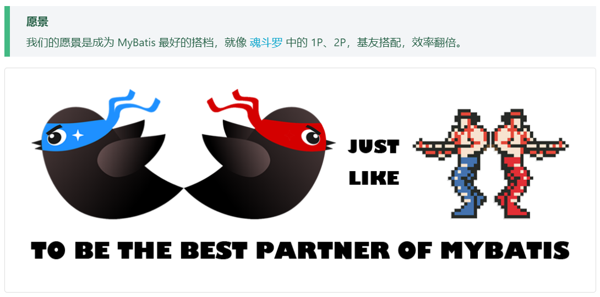

# MybatisPlus Demo


## 简介

[MyBatis-Plus ](https://baomidou.com/)（简称 MP）是一个 MyBatis 的增强工具，在 MyBatis 的基础上只做增强不做改变，为简化开发、提高效率而生。




## 入门案例


### 1. 创建数据表 User

```mysql
CREATE TABLE user
(
	id BIGINT(20) NOT NULL COMMENT '主键ID',
	name VARCHAR(30) NULL DEFAULT NULL COMMENT '姓名',
	age INT(11) NULL DEFAULT NULL COMMENT '年龄',
	email VARCHAR(50) NULL DEFAULT NULL COMMENT '邮箱',
	PRIMARY KEY (id)
);
INSERT INTO user (id, name, age, email) VALUES
(1, 'Jone', 18, 'test1@baomidou.com'),
(2, 'Jack', 20, 'test2@baomidou.com'),
(3, 'Tom', 28, 'test3@baomidou.com'),
(4, 'Sandy', 21, 'test4@baomidou.com'),
(5, 'Billie', 24, 'test5@baomidou.com');
```


### 2. 创建 Spring Boot 工程


### 3. 引入依赖

修改你的 pom 文件

```xml
    <!-- 配置 Spring Boot 版本 -->
    <parent>
        <groupId>org.springframework.boot</groupId>
        <artifactId>spring-boot-starter-parent</artifactId>
        <version>2.3.4.RELEASE</version>
    </parent>

    <dependencies>
        
        <dependency>
            <groupId>org.springframework.boot</groupId>
            <artifactId>spring-boot-starter-web</artifactId>
        </dependency>

        <dependency>
            <groupId>org.springframework.boot</groupId>
            <artifactId>spring-boot-devtools</artifactId>
            <scope>runtime</scope>
            <optional>true</optional>
        </dependency>

        <dependency>
            <groupId>org.springframework.boot</groupId>
            <artifactId>spring-boot-starter</artifactId>
        </dependency>

        <dependency>
            <groupId>com.baomidou</groupId>
            <artifactId>mybatis-plus-boot-starter</artifactId>
            <version>3.4.1</version>
        </dependency>

        <dependency>
            <groupId>mysql</groupId>
            <artifactId>mysql-connector-java</artifactId>
            <scope>runtime</scope>
        </dependency>

        <dependency>
            <groupId>org.projectlombok</groupId>
            <artifactId>lombok</artifactId>
            <optional>true</optional>
        </dependency>

        <dependency>
            <groupId>org.springframework.boot</groupId>
            <artifactId>spring-boot-starter-test</artifactId>
            <scope>test</scope>
        </dependency>
        
    </dependencies>
```


### 4. 修改配置文件


```properties
# 端口号
server.port= 8082

# ==================== 数据源设置 =========================
spring.datasource.driver-class-name=com.mysql.cj.jdbc.Driver
spring.datasource.url=jdbc:mysql://localhost:3306/test?serverTimezone=GMT%2B8&characterEncoding=utf-8&useSSL=false
spring.datasource.username=root
spring.datasource.password=123456

# ================ mybatis 配置 =========================
# 驼峰命名
mybatis-plus.configuration.map-underscore-to-camel-case=true
# 扫描映射配置文件
mybatis-plus.mapper-locations=classpath:mapper/*Mapper.xml
```


### 5. 创建实体类

创建包 **entity** 并创建 **User** 实体类

```java
package com.frankeleyn.entity;

import lombok.AllArgsConstructor;
import lombok.Builder;
import lombok.Data;
import lombok.NoArgsConstructor;

/**
 * @author Frankeleyn
 * @date 2022/1/14 16:24
 */
@Data
@NoArgsConstructor
@AllArgsConstructor
@Builder
public class User {

    // 主键
    private Long id;

    // 名字
    private String name;

    // 年龄
    private Integer age;

    // 邮箱
    private String email;

}
```


### 6. 创建 Mapper 接口

创建包 **mapper** 并创建 **UserMapper** 接口继承 **BaseMapper** 接口

```java
package com.frankeleyn.mapper;

import com.baomidou.mybatisplus.core.mapper.BaseMapper;
import com.frankeleyn.entity.User;

/**
 * @author Frankeleyn
 * @date 2022/1/14 16:33
 */
public interface UserMapper extends BaseMapper<User> {
    
}
```


### 7. 添加启动类注解

给启动类添加注解 **@MapperScan** ，要不然会报一个找不到 Mapper 的错误

```java
package com.frankeleyn;

import org.mybatis.spring.annotation.MapperScan;
import org.springframework.boot.SpringApplication;
import org.springframework.boot.autoconfigure.SpringBootApplication;

@SpringBootApplication
@MapperScan("com.frankeleyn.mapper")
public class MybatisPlusDemoApplication {

    public static void main(String[] args) {
        SpringApplication.run(MybatisPlusDemoApplication.class, args);
    }

}
```


### 8. 添加测试类进行功能测试

```java
package com.frankeleyn;

import com.frankeleyn.mapper.UserMapper;
import org.junit.jupiter.api.Test;
import org.springframework.beans.factory.annotation.Autowired;
import org.springframework.boot.test.context.SpringBootTest;

/**
 * @author Frankeleyn
 * @date 2022/1/15 10:42
 */
@SpringBootTest
public class UserDaoTest {
    @Autowired
    private UserMapper userMapper;

    @Test
    public void testFindAll() {
        userMapper.selectList(null).forEach(System.out::println);
    }
}
```

打印结果：


